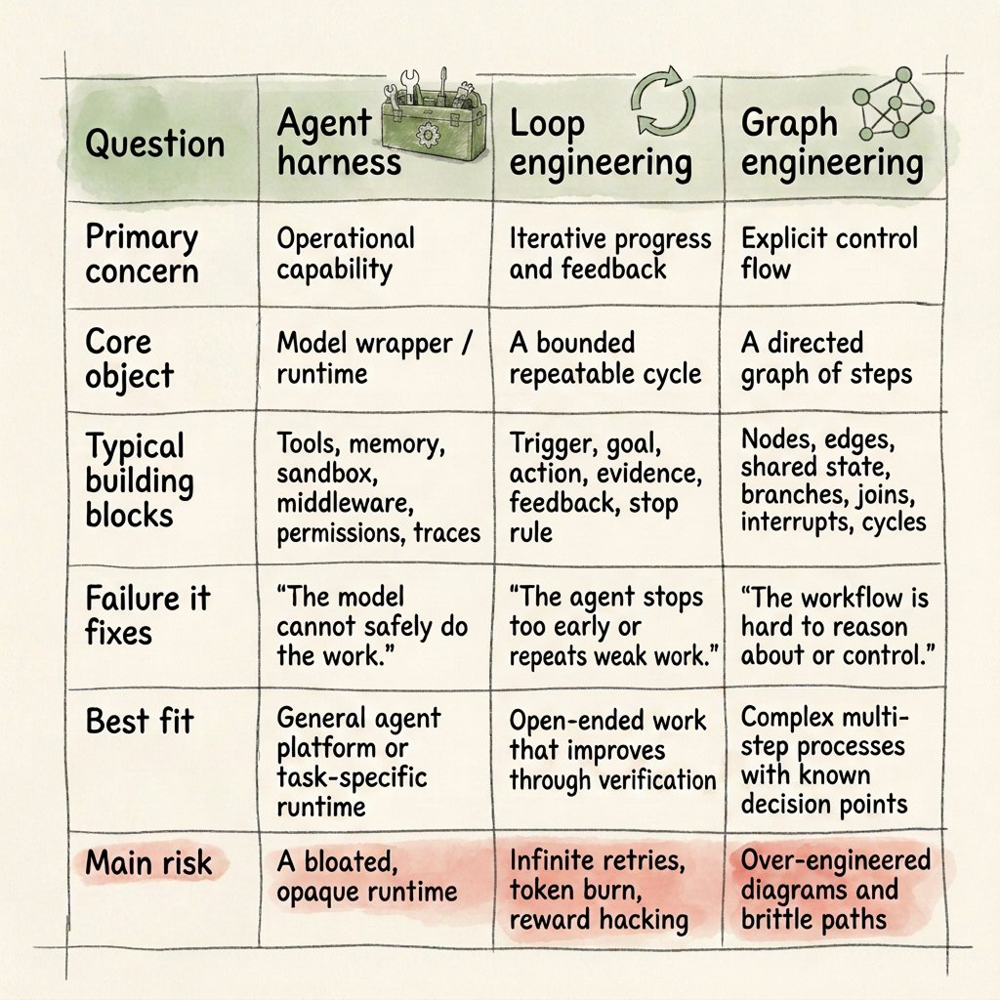
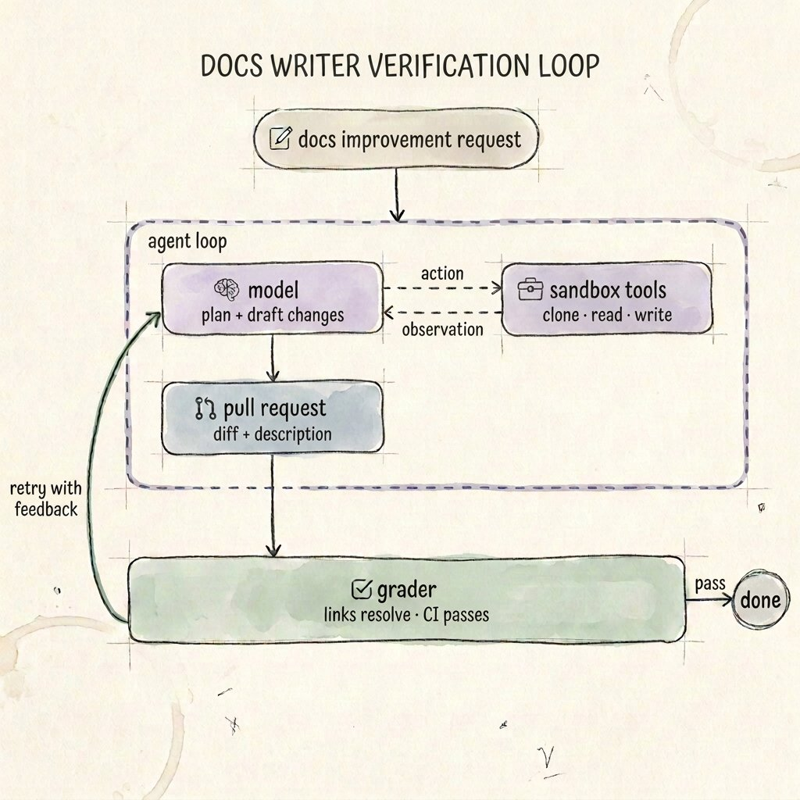

最近 Agent 圈有三个词被说得特别多：harness、loop、graph。@beamnxw 7 月在 X 上写了篇长文，专门把这三个拆开讲，我看完觉得挺清楚，顺手整理一下。

简单讲，harness 管 agent 有没有条件干活，loop 管它干完怎么检查、要不要重来，graph 管下一步该轮到谁。大家可以先看这张表，每一列是一层，最后一行是每层最容易出的问题。

我最在意的是 loop 那一格，写着无限重试、烧 token、reward hacking。reward hacking 这个词全文就出现了这一次，但我觉得它是三层里最难缠的。

可以很粗略地理解成：检查器量什么，agent 就往什么方向使劲。检查器量歪了，它就照着歪的方向干，循环跑得越勤，交上来的错活越理直气壮。

我平时看 F1，车队早就把这件事玩明白了。规则怎么量，车就往哪里长，2009 年 Brawn 的双层扩散器就是从规则的缝里钻出来的，那年还拿了总冠军。

harness 这个词有个特别好记的定义：把模型从架构图里删掉，剩下的基本都是它。提示词、工具、记忆文件、沙箱、权限、日志，全算。

所以同一个模型，两个团队能用出完全不同的结果。一边给了干净的工具、固定的工作区、收紧的权限，另一边只给了一句模糊的 prompt 和一个时好时坏的 API。模型差不多，干活的条件差远了。

Anthropic 做长时间写代码的 agent 时就踩过这个坑。光压缩上下文不够，后来加了初始化步骤、进度文件和 git 记录，规定每次只做一小步，新开一个上下文也能马上知道做到哪了。prompt 没怎么改，改的是工作环境。

loop 是 agent 干完之后的事。每个会用工具的 agent 本来就在转一个小圈：调模型、跑工具、看结果、再调模型。

loop engineering 就是在小圈外面再套几圈。比如写完跑一遍测试，没过就带着报错重写；有新文件进来，就自动把它叫醒。大家看下面这张图，左边那条绿线就是「没过就带着反馈重来」。

文章里我最认的一句是：别凭自信循环，凭证据循环。「agent 说做完了」不算停，「测试过了、链接能打开、格式校验通过、有人点了头」才算停。

问题是证据也会量歪，这个我前两天刚体验过。我给自己的稿子配了一个检查脚本，量段落多长、页末有没有断在半句、「其实」「真正」这类词有没有超标。

10-02 那篇，脚本一条都没拦。发出去以后，评论区赞最多的一条有 47 个赞：「看着本文溢出屏幕的 AI 感我觉得这段提示词恐怕没啥效果」。

脚本量的是节奏，读者读出来的是套路：一句话单独一段，先让一步再转折，几个理由排成一二三。节奏全对，套路一个没少，跟那个双层扩散器差不多，量的地方都合规，跑起来完全是另一回事。

后来我给脚本加了一张黑名单，把那几种句式都列进去了。不过黑名单只能拦见过的套路，下一种它照样看不见，这事我现在也没想到更好的办法。

所以我现在看一个 loop，先不管它循环几次、拿哪个模型当裁判，先看检查器量的东西，跟我真正在乎的东西差多远。

能用固定规则检查的，就别让模型给自己打分；非要模型审，换一个没看过草稿的上下文去审；影响大的动作，留给人来点头。毕竟同一个模型自己写自己改，它写的时候没看见的地方，改的时候大概率也看不见。

graph 是第三层，管顺序：哪一步之后能走到哪一步，哪里分叉、哪里并行、哪里必须停下来等人签字。LangGraph、AutoGen 做的就是这一层。

一个人用 Claude、Codex 干活的话，我觉得大多数时候还用不上它。一个 agent 配几个工具就能干完的活，硬画成流程图，只会把还没想清楚的假设提前冻住。更稳的做法是先让它跑几遍，看清哪几步每次都一样，再把那几步固定下来。

agent 出问题的时候，我会按这四个问题过一遍：

1. 它做不了、做着做着忘了前面、手伸得太长？修 harness：补工具，加一份进度文件，收紧权限。

2. 它停得太早，或者一直交差不多的活？修 loop：写清楚什么证据算完成、失败了反馈什么、最多重来几次。

3. 流程说不清下一步该谁接、哪一步必须等人？这时候才轮到 graph。

4. 检查全过了，结果还是不对？先别换模型，回头看检查器到底在量什么。

第 4 条是我自己加的，表里没有。它最容易被漏掉，因为检查器一过，大家都会松一口气。

我手机上常开的就是 Claude、Codex、Grok 这几个 bot。给它们派活的时候，可以把这段直接贴在最后：

「做完不要只告诉我"完成了"。先列出你用什么证据证明它完成了：跑了哪条命令，结果是什么。证据不过，就带着失败原因重做，最多 3 次；3 次还不过，停下来告诉我卡在哪。再说一种情况：你的检查都过了，但结果仍然可能是错的。」

最后那句是让它自己给检查器找漏洞，不一定找得全，但至少会把「检查过了」和「做对了」分开说。

这篇我那个脚本也跑过了，全过。至于活到底错没错，还是看评论区吧。
