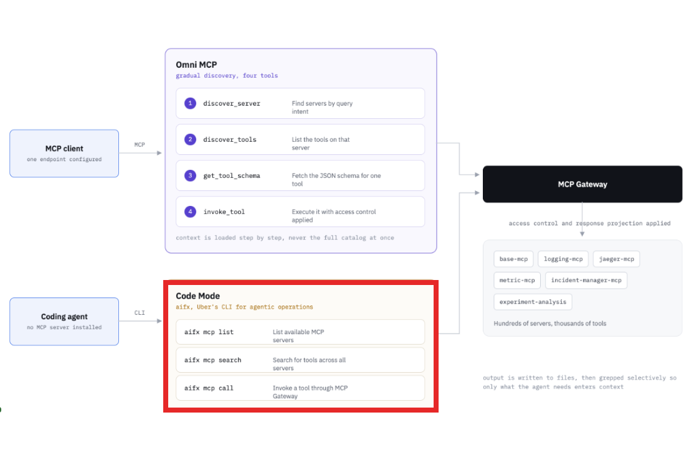

越来越觉得，MCP 的问题不在协议，在大家装它的方式。

Uber 工程团队 10 月 1 日发了篇博客，讲他们怎么给全公司建 MCP 网关：800 多个 MCP server，5000 多个工具，再往后一翻，写代码的 agent 默认根本不走 MCP，走命令行。大家看这张图，左上角的 9110 是他们目前的 server 数量。

我上一篇 harness 稿里写过，工具和权限是 agent 干活的条件。Uber 这篇等于把「条件」做到了公司级，很多人第一反应会觉得这是大厂才需要的基建，其实它最后得出的几条，一个人配 Claude Code 也一样用得上。

1、把现成的 API 自动变成 MCP 工具，比让每个团队手写 server 快得多。Uber 内部有几千个服务，接口定义都在一个注册表里，他们写了一个叫 AutoCrawler 的爬虫定时扫它。

扫到一个接口，就把参数和注释抓出来，让 LLM 补一段 agent 看得懂的说明，再翻译成 MCP 的格式塞进目录。比如一个查退款记录的接口，服务团队什么都不用改，第二天目录里就多了一个「查退款记录」的工具。

博客里那句 existing APIs are the fastest way to provide tools to an agent，我很认。

2、自动生成的工具，默认全是关的。这是整篇我最在意的一条。目录里的 5000 个工具，刚进去时一个都不能用，必须由那个服务的负责人看一遍说明、确认没问题，手动打开。

改一次工具描述就要走一次审批，能回滚。Uber 管这个叫 discovery doesn't imply exposure，能被发现不等于能被调用。那个查退款记录的工具，退款团队不点头，agent 就看不见它。

3、工具一多，agent 先被撑死的不是能力，是上下文。MCP 本身没有跨 server 搜索这回事，agent 得先知道该找哪个 server，才能问它有什么工具。

几百个 server 全挂上去，光工具说明就把窗口吃完了，钱也跟着烧。

Uber 的解法叫 Omni MCP，agent 只装这一个 server，里面四个工具：搜 server、列工具、拿某个工具的参数、调用。

agent 要查退款，先搜「退款」找到 server，再列工具，再拿参数，最后才调。四步走完，上下文里只多了这一个工具的说明，不是 5000 个。

4、能用命令行就不用 MCP。写代码的 agent 本来就活在终端里，Uber 给它们做了一个命令行工具 aifx，三条命令：列 server、搜工具、调用。

agent 把结果写进文件，再用 grep 挑自己要的那几行读，整个过程不需要装任何 MCP server。大家看下面这张图，我把 Code Mode 那块框出来了，这是现在 Uber 写代码 agent 的默认方式。

也就是说，花了这么大力气建的 MCP 网关，最后在 coding agent 这边的入口是三条 shell 命令。

5、返回的内容也得裁，不然省下的上下文又被一条用户资料吃回去。Uber 给每个工具的请求加了一个字段，让 agent 自己写只要哪几个字段，网关在返回前把其他的全删掉。查退款记录只要金额和时间，就不会把整条用户资料灌进上下文。和 GraphQL 一个思路。

6、个人用户之前的装法，和 Uber 这几条每一条都是反的。我第一次配 agent team 的时候，给一个 agent 接了 data query 的 MCP，当时的做法就是能接的都接上，觉得工具越多越聪明。

现在对着 Uber 这篇看：工具默认全开、agent 启动就把所有说明读一遍、返回的东西不裁，三样我全占了。我不会再这么装了。

我觉得一个人配 Claude Code 或者 Codex，可以直接抄 Uber 的三条。工具默认关，用到那天再开。别一次装十几个 server，先问问自己能不能用一条 CLI 替掉。大结果先写文件，让 agent 自己 grep。

换成不写代码的人，这件事是公司给新员工开账号。有的公司入职第一天把两百个系统的权限全开给你，你一个也记不住，还处处是风险。

有的公司只给你一个内部搜索，用到哪个系统那天再申请。Uber 选了第二种，我也选第二种。

7、有人可能会说，我就两三个 MCP，用不着这么折腾。确实，两三个的时候上下文还吃得消。

真正的麻烦在于它只会往上长，每个新工具都看起来「装上也不亏」，等 agent 开始漏指令、乱调用，你很难说清是哪一个撑的。

局限我也说一句：Omni MCP 和 aifx 都是 Uber 内部的，外面装不到。个人能用的是思路，不是代码。Claude Code 的 MCP 配置目前也没有「默认关、按需开」的开关，得自己管。

可以直接贴进 CLAUDE.md 的一段：

「调用工具前先确认是不是必须。能用 shell 命令、能读本地文件解决的，不要调 MCP。调用返回的内容超过 50 行，先写进文件，再只读你需要的部分。不要在任务开始时把所有工具说明读一遍。」

这段不能替你关掉多余的 server，那个还得你自己动手删。
