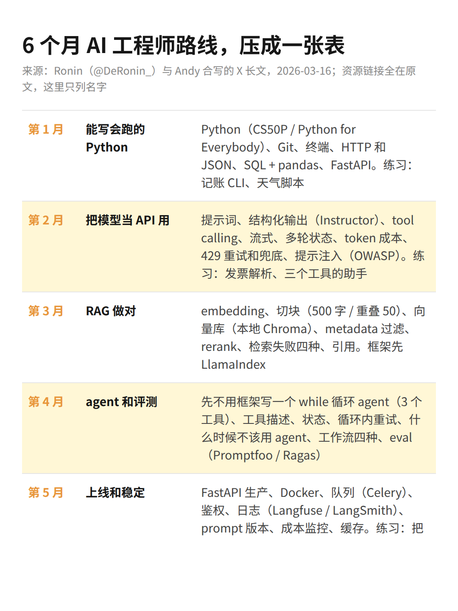

国庆假期在巴厘岛，手机上把一篇一万多词的长文翻完了，讲怎么用 6 个月从零变成 AI 工程师。3 月发的，2.6 万人收藏。作者叫 Ronin，20 岁，简介写着 CEO 和天使投资人，我没去查他，反正文里的链接全是官方文档，这个我点过。看完想写几句自己的理解，主要不是关于这篇，是关于「AI 工程师」这个岗位本身。

AI 工程师这个词，我一直觉得有点唬人。看完这篇更这么觉得了。

长文给的定义是：不训练模型，在现成模型上做产品。接 API、写提示词、接工具、让输出变成固定格式、管成本、部署出去。照这个定义，在 OpenAI 训模型的人反而不算，公司里把 Claude 接进客服流程的运营倒算。好像，这个岗位的边界本来就不是技术画的。

他把六个月排成这样：第 1 个月 Python 和基础，第 2 个月把模型当 API 用，第 3 个月 RAG，第 4 个月 agent，第 5 个月上线，第 6 个月三选一做作品集。我压成了一页，大家先扫一眼，后面说的「第几个月」都是指这张表。

写几点自己的判断。

1、「AI 工程师」这个岗位名，我觉得撑不过两年。

它会往两头散。一头散进每个普通岗位，PM、运营、分析师，谁都要会一点；另一头缩回后端，变成做基建的那几个人。中间这个「AI 工程师」的位置，现在看着热，是因为两头的人都还没补上来。

假设我下周一带一个新来的实习生。第一天我不会教他 Python，我会教他给 Claude 派活：要什么格式先说清楚，能用哪几个工具先给它，它没有记忆，每次都得把前面的话重发一遍，这一次大概多少钱心里要有数。

这就是表里第 2 个月那一行的全部内容，八样东西。我相信以后这八样会变成入职培训，像当年的 Excel。

2、学 agent，写一次 while 循环就够了，框架先别碰。

第 4 个月那一行有一条我特别认同：别用框架，拿 API 直接写一个 while 循环的 agent，三个工具，一个目标。写代码的人四行就够了。while True：问模型下一步干什么；它要调工具就调，结果塞回对话；它说做完了就停；超过 10 轮也停。

比如我这周末想做个小东西，每天早上七点把我的日历和邮件捋一遍，告诉我今天哪件事最容易漏。三个工具：读日历、读邮件、发一条消息给我。这个循环写出来大概就是一个下午的事，不需要 LangGraph。

前两天写的 Uber 那篇，5000 个 MCP 工具默认全关，agent 要用自己去搜，也是同一个道理：工具少一点，循环短一点，先跑起来。

写完这个再去看框架，才知道它替你包掉了什么。是的，大部分人不会去写，但看懂过一次和完全没看过，给 AI 派活的时候差很多。

3、工程师和「会用 AI 的人」的分界线，我觉得在部署那一个月，而且这条线还在往后退。

上线那个月，也就是第 5 个月：Docker、队列、鉴权、日志、prompt 版本管理、成本监控、缓存。到这一行我就不认识了。前四个月 PM 都能撞上，这一行撞不上，也没必要。

但这条线在动。比如我现在想把周末写的那个小东西放到云上每天跑，去年要自己配服务器，今年让 Claude Code 自己配，我只负责看它报错。再过一年，可能连看报错都不用。所以我感觉这条分界线以后还会往后退，退到头，「AI 工程师」剩下的就是做模型和做基建的人，中间的全散进了各个岗位。

4、他文末写了一句自己招人的标准：六个月结束，手里得有几个能点开的东西，不是学完理论。

这句放在 PM 身上也成立。以后面试一个 PM，问的不会是你会不会用 AI，是你用 AI 做出来过什么，能不能现在打开给我看。

RAG 那个月我没亲手做过，公司里有人做，我只是用，所以那一行难不难我说不好，没写。

总之，这张表的名字我觉得起错了。它不是工程师的表，是所有拿 AI 干活的人的表，而且以后会越来越像。
