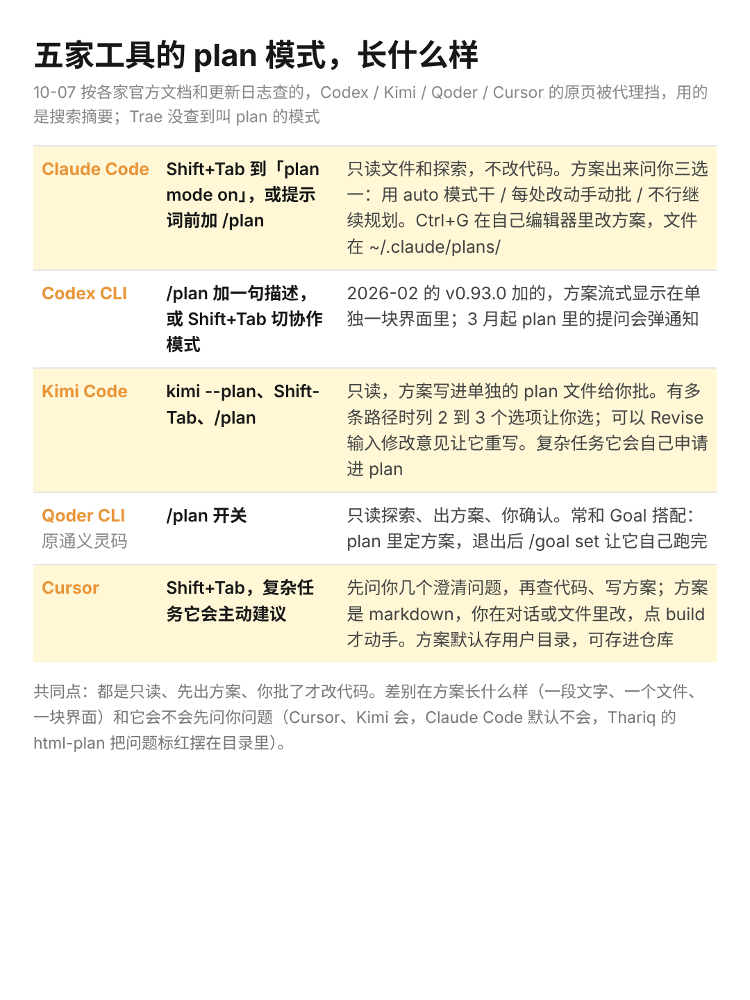
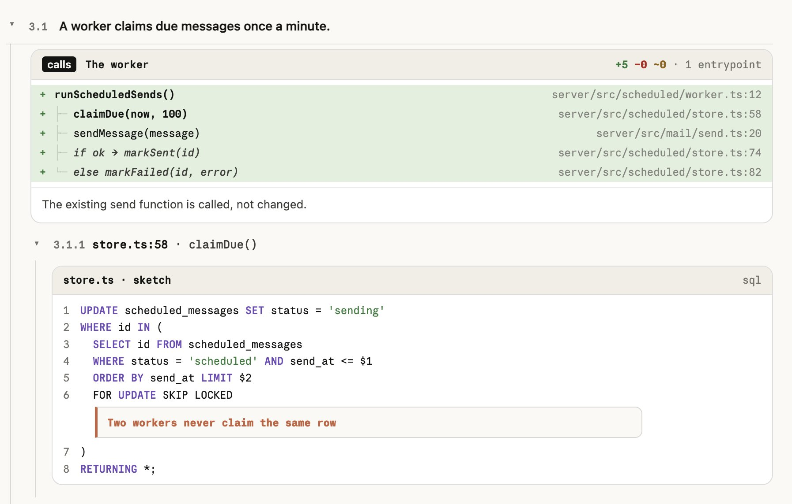

给 Claude Code 的指示写得再明确，做出来还是会偏，这事我碰到的次数不少。这周 Claude Code 团队的 Thariq 发了个 skill，把 plan 做成一个网页，4500 多人收藏。看完我去把各家的 plan 模式查了一遍，想弄清楚普通人到底该怎么用这个东西。

先说 plan 模式是什么。你让 AI 改代码，它不直接动手，先读你的项目，写一份方案给你看，你点头它才改。

Claude Code、Codex、Kimi Code、Qoder（原通义灵码）、Cursor 都有，进法差不多，Shift+Tab 或者打 /plan。Trae 我没查到叫这个名字的模式。各家的差别压成了下面这张表。

1、在 Claude Code 里，plan 模式实际是这样走的

按 Shift+Tab 切到「plan mode on」，再说你要做什么。它开始读文件、跑一些查看类的命令，不改任何代码。

方案写好以后弹三个选项：用 auto 模式直接干；每处改动手动批；不行，继续规划。按 Ctrl+G 能在你自己的编辑器里直接改这份方案，文件存在 ~/.claude/plans/ 里。

Kimi Code 多一步，方案有几条路径时它列 2 到 3 个选项让你挑，还能输入修改意见让它重写。Cursor 在写方案之前会先问你几个澄清问题。Claude Code 默认不问，这就是 Thariq 那个 skill 补的东西。

2、他做进网页里的，是一份方案该有的几样东西

视频里的例子是给邮件产品加「定时发送」。网页左边目录四条需求全是大白话，每条下面挂一个红色问题：一个用户最多排几条？发失败要不要重试？用户怎么知道失败了？右下角写着还有 3 个要答，不答完方案停在那里。

每条需求下面一棵调用树，写信框组件加一个菜单，调一个新接口，后端先查上限再写表，每行跟着文件名和行号，右上角「+6 -0 ~1」。树下面一行小字：现有的发送函数只是被调用，没有改。

再往下是状态图，一封定时信从排队到发送中到已发或失败，新加的线用虚线。mockup 用项目里已有的组件拼，他回复里说这样也省 token。README 里他写的目标是，整份方案一分钟能看完，树收起来就是摘要。

3、不装插件，这几样直接打进提示词也要得到

我觉得这才是普通人该拿走的部分。他把它们做进 skill 是为了每次都有，但你在任何一家的 plan 模式里说下面这几句，效果是一个方向的。

「方案里先列出需要我拍板的问题，别替我默认。」「列出这次要动哪些文件，哪些明确不动。」「需求用一句大白话写，不写技术词。」「界面用项目里已有的组件，不要新画。」「方案控制在我一分钟能看完的长度。」

前两句对应他的红色问题和调用树，是我用下来最容易让 Claude 偏的两个地方：它默认了一个你没同意的选择，或者顺手改了一个你以为它不会碰的文件。

想装的话两行命令，放在图下面了。装完要用 /html-plan 加一句描述来调，要本机有 Node.js，它把页面打成一个 HTML 文件。界面有人嫌乱、字号太多，他自己也说设计还没做完，现在装上看到的是个半成品。

不写代码的人也用得上。Claude Code 本来就能在笔记文件夹里跑，让它整理一堆文档之前先出方案，红色问题那一步照样管用。

人是视觉动物，网页和图表传信息的效率本来就比一大段文字高，这是我同意他把 plan 做成网页的原因。但方案长什么样是第二步，第一步是它先把要你定的事问出来。
