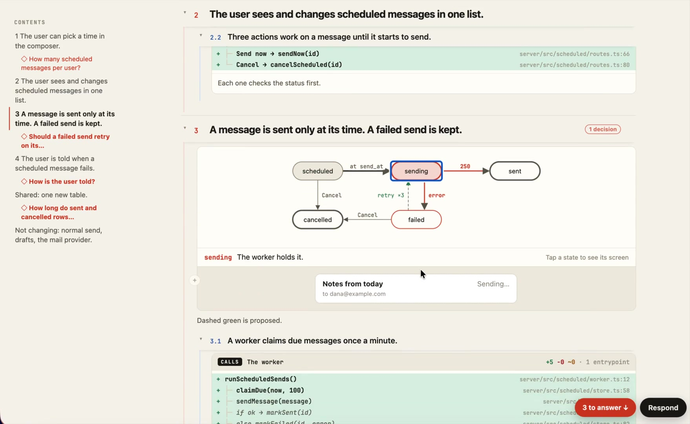

给 Claude Code 的指示写得再明确，做出来的东西还是会偏，这事我碰到的次数不少。plan mode 我用得不多，一个原因就是它给我的 plan 是一大段 markdown，我看过一眼觉得没问题，做出来是另一回事。

这周 Claude Code 团队的 Thariq 发了个还没正式上线的 skill，把 plan 做成一个网页。推文 4500 多人收藏，他说想拿它替换掉默认的 plan mode。

我看完视频的感觉是，plan 的内容其实没变多少，变的是它逼着 Claude 把三样东西摆到你眼前，而这三样也是 markdown 里最容易被你扫过去的。

1、要你拍板的问题，标红列在目录里

左边目录是四条需求，每条下面挂着一个红色的问题：一个用户最多能排几条？发送失败要不要自动重试？用户怎么知道失败了？发过的记录留多久？右下角一个按钮，「3 to answer」。

这几个问题在 markdown 的 plan 里也在，只是埋在第三段第四句，前面写着「默认重试三次」，你扫过去就等于同意了。做出来偏了，回头看 plan，它确实写了，你确实没看。

所以这个 skill 把它们拎出来标红，不回答完它不往下走。我觉得这是三样里最有用的一样，比什么 mockup 都实在。

2、改哪几处文件，画成一棵调用树

每一条需求下面有个 CALLS 框：Composer 组件里加一个 SendLaterMenu，它去调 POST /api/scheduled，后端 createScheduled 先查上限、再组装、再写表。每一行后面是文件名和行号，右上角「+6 -0 ~1，2 个入口」。

你不用会写代码，看这棵树就知道这次要动几个文件、新增还是改旧的、有没有碰到不该碰的地方。

它下面还有一行小字：现有的发送函数只是被调用，不会被改。这句话在 markdown 里一般不会有，因为没人会想到要写。

3、状态流转画成图，mockup 用现有组件拼

一条定时消息有五个状态：排队、发送中、已发、失败、已取消。文字版要写五句话，图上一眼看完，哪条线是新加的用虚线标出来。点一个状态还能看它对应的界面长什么样。

mockup 这块他特意回复了一个人的问题：是复用项目里已有的组件，不是每次重新画一套。有人问 HTML 会不会比 markdown 费 token，他说用的是组件，差不多。

界面有人嫌乱，字号太多，他认了，说还要再调。

装法两行命令，放在图下面了。装上以后 plan mode 还是老样子，要主动说一句「用 html-plan 做 plan」。对不写代码的人它更有用：拿到网页只回答红色的问题，调用树和状态图看个大概，不用读几十行 markdown 猜 Claude 打算干什么。

不管是产品经理还是别的什么人，都是视觉动物，网页和图表传信息的效率本来就比一大段文字高。AI 写的 plan 以后会越来越长，我不认为人会越来越有耐心读它。
