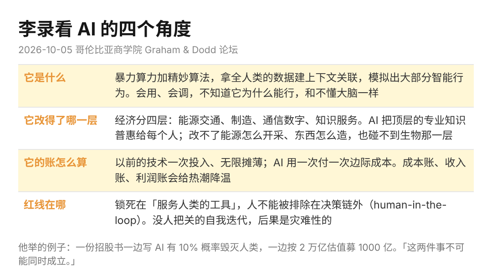

趁放假看了李录这周在哥伦比亚商学院的对谈，他讲 AI 的那二十多分钟，和硅谷那套讲法不在一个坐标系。讲 AI 的人很多，一个靠看懂现金流吃饭三十年的人怎么看待这项技术，是另一个视角。

李录 1966 年生在唐山，哥大六年拿了三个学位，1997 年创办喜马拉雅资本。查理·芒格说自己一辈子把家族的钱交给外人管，只有李录一例。巴菲特投比亚迪，是他推荐的。

这场对谈是 10 月 5 日哥大商学院的 Graham & Dodd 论坛，主持人本来要聊价值投资，他说顺便聊聊 AI。

1、他觉得这一波的反常处，在于 AI 正往「独立物种」那一头滑

他说以前所有技术本质上都是工具，这次多了一个变量：AI 在「死板的工具」和「独立的物种」之间摇摆，而且正往物种那头偏。四年前大模型过了图灵测试，然后会推理，会推理就会写代码，会写代码就成了能自己干活的 agent，再往下是一群 agent 分工协作干长任务。他说这就是现在所处的阶段。

硅谷的讲法是下一步进递归自我改进，机器自己升级自己，然后 AGI、ASI。他说照这个逻辑推，等于人类在造一个半神，万亿美元的 IPO 就像认购神明上市的股票。

他的回答是，没有人愿意活在一个只有极少数人能接触、没人能理解、没人能控制的神明主宰的社会里。所以结局只有两种：技术根本不会往那走；或者真往那走了，人类社会会联手叫停。

2、他给 AI 下的定义，没有一个字是神

他说如果非要下一个暂定的定义：一台靠暴力算力加精妙算法运作的机器，把全人类产生的数据当养料，在变量之间建起一套上下文关联，用这套关联模拟出包括逻辑推理在内的大部分智能行为。

然后一句：眼下我们只知道怎么用它、怎么调它，底层上并不清楚它为什么能行，和搞不懂大脑是一回事。

接着他把经济分成四层，最底层能源和交通，往上制造，再往上通信和数字媒体，最顶层是知识型服务业。现在的 AI 是个绝佳的知识普惠工具，把顶层沉淀的专业知识打散给每个普通人。

它改不了能源怎么开采、东西怎么造，因为制造是分子原子重组的物理过程。生物那一层更碰不到，他说一个细胞的数据量就要几十个 TB，乘以人体万亿级的细胞数，现在的技术差了十万八千里。

3、成本账是他最像投资人的一段

以前的技术一次性投入，后面可以无限摊薄；AI 不是，你只要用它，就得源源不断地付边际成本。所以成本账、收入账、利润账会变得至关重要，资金链的门槛和财务纪律会给这场热潮降温。

他举的例子是一份招股书：一家自称实验室的公司，烧了几百亿美元，承诺再烧几千亿，同时写着有 10% 的概率毁灭全人类，然后邀请大家按 2 万亿估值投 1000 亿。他说这两件事不可能同时成立，它展示的是市场能失去理性到什么程度。

他没点名是哪家。

4、红线：人不能被排除在决策链外

他说的红线是，无论技术怎么训练、工具怎么用，绝对不能把人类排除在决策链条之外，必须把它锁定在服务人类的工具这个属性上。没有人把关的完全自主迭代，后果是灾难性的，因为它会长出自己的目标、子目标和意图。

主持人接了一句：那未来最稀缺的人，是能监督和校验 AI 输出的人。他说是，大致就是这个道理。

我自己配 agent 干活，到现在还是每一步看一眼再放行。两年后会不会还这样不好说，有些活人在回路里审一遍，比自己干还慢，这类活的比例以后只会越来越高。

5、硅谷问「它还能做到什么」，中国问「它能给我的客户带来什么」

后面有人问中国的 AI，他说硅谷发展 AI 的核心问题只有一个，这项技术还能做到哪些不可能的事，所以他们自称实验室，叫这个「前沿」。中国的 AI 企业对底层问题同样好奇，但更关心的是这项技术能帮客户解决什么实际问题，面对消费者和企业客户都是。两种思路从各项指标里都看得出不同结果。

我在美国待过八年，对这个分法的体感很直接。国内的风格是急着给客户创造价值，没有 value added 的事情不长久；美国那边的原始动力不是物质，是对自由和真理的热爱，差异从这里来。

他最后说的一句是，包括 AI 在内的科技都只是辅助人的工具，不是人的替代品。
