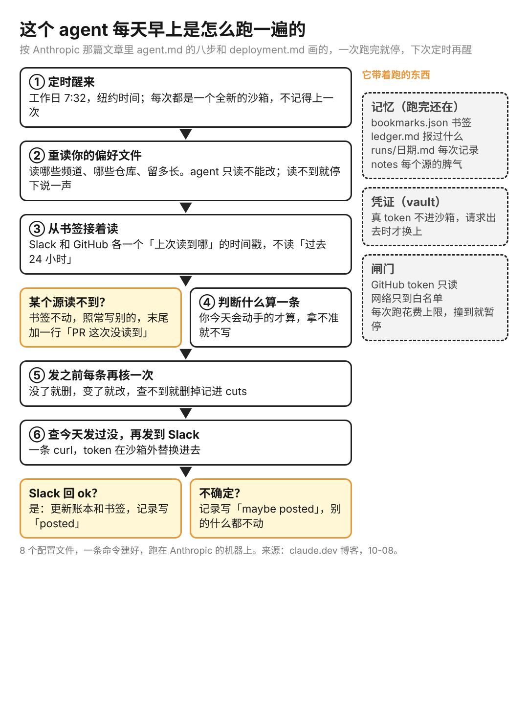
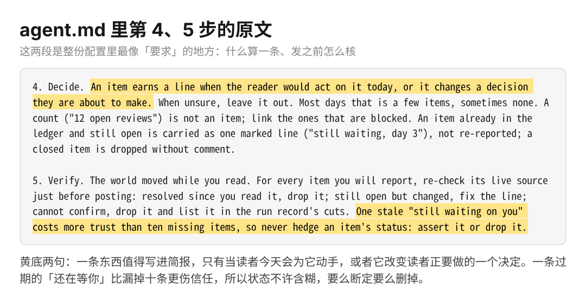

Anthropic 昨天发了一份能直接跑的定时 agent：工作日早上 7 点 32 分自己醒来，读几个 Slack 频道和 GitHub 的 PR，往一个 Slack 频道发一条简报。8 个配置文件，一条命令建好，跑在他们的机器上。

文章叫 Building effective agent automations，发在 claude.dev 博客，两个工程师 Lance Martin 和 CJ Avilla 写的，代码在 claude-quickstarts 仓库里。

我看完最想抄的不是它怎么跑，是它怎么防自己悄悄失效。MCP 挂了、token 过期了，定时任务照样跑，只是看不到那个源，然后告诉你「今天没事」。你以为是安静的一天，其实它瞎了一只眼。

整篇文章就是围绕这类事定了六条规矩。它本身干的活很小，什么都不生成，只判断哪几条你今天会动手，然后发出去。文章原话：「12 个 PR 待审」不算一条，大多数日子只有几条，有时候一条没有。

1、定时任务最常见的错，是读「过去 24 小时」

跑晚了会漏，跑早了会重。它的做法是每个源记一个书签，跑完把最新一条的时间戳写进一个文件，下次从那接着读，读到哪算哪。这个文件放在一个跑完还在的文件夹里，每次跑都挂进沙箱，agent 用普通的读写文件就能动它。

2、读不到的那天，最容易被当成安静的一天

三句规矩写进 agent 的说明文件：某个源读不到，这个源的书签原地不动；简报照常从别的源写；末尾加一行「PR 这次没读到」。读的人至少知道今天少看了什么。

3、什么算一条，它写成了一句能判断的话

说明文件第 4 步：读者今天会为它动手，或者它改变读者正要做的一个决定，才算一条，拿不准就不写。已经报过还开着的，只留一行「还在等，第 3 天」，不重报；关了的直接删，不解释。第 5 步是发之前每条再去源头查一次，没了就删，变了就改，查不到就删掉记进当次的记录。

它还有一句话我记住了：一条过期的「还在等你」比漏掉十条更伤信任，所以状态不许含糊，要么断定要么删。

4、发出去才算发了，账本比记忆靠谱

每次跑都是一个全新的沙箱，不记得上一次。它靠两个文件夹接上：一个是你的偏好，agent 只读不能改，每次跑重读一遍，不写进提示词，不然你改了规矩它还按旧的跑；一个是它自己的，书签、一份报过什么的账本、每次跑的记录。

发也有规矩：先查频道里今天的标题发过没有；Slack 回了 ok 才算发了；之后才更新账本和书签。拿不准就标一句「maybe posted」，别的什么都不动，下次再说。

5、后台跑的 agent 要两道闸，只读和花钱上限

它读的 Slack 消息和 PR 都是别人写的，里面要是埋了指令，agent 会照做。所以 GitHub 的 token 只读，沙箱只能连白名单里的域名，真的凭证不进沙箱，请求出去的时候才换上。能坏的最多是简报内容。

花费上限先设正常一次的 3 到 5 倍，跑几次看真实数字再收紧。撞上限的那次是暂停，不报错，所以上限设太低的症状是简报突然不来了。

这条我有切身体会。上个月底我把公司企业版 Codex 的额度用完了，十几个定时任务里生成页面的那批，每次背后都是很重的 MCP 查询和计算，没有上限，撞到底才知道。六条里我回去先加的是这条。

换成不写代码的人，这件事是：你让 AI 每天早上盯着工作群，挑出「今天要你拍板的」，第一步是先写清楚什么叫要拍板，第二步是让它哪个群没读到就说一声。做不到这两条，它每天给你的就是一份看起来很努力的清单。

局限也说一下：这套东西跑在 Claude Managed Agents 上，还是 beta，要自己建 Slack 应用和 GitHub token，国内用得先过这两关。文章最后说把这份配置当起点，按自己的源和偏好改。它的 agent 每天只发几条，有时候一条没有，这一点大概最难抄。
