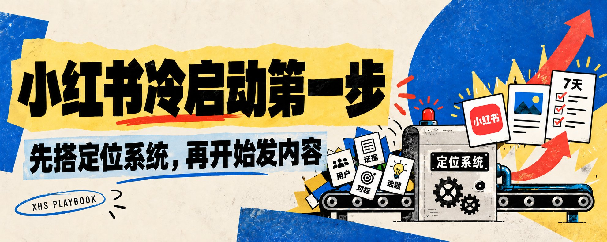
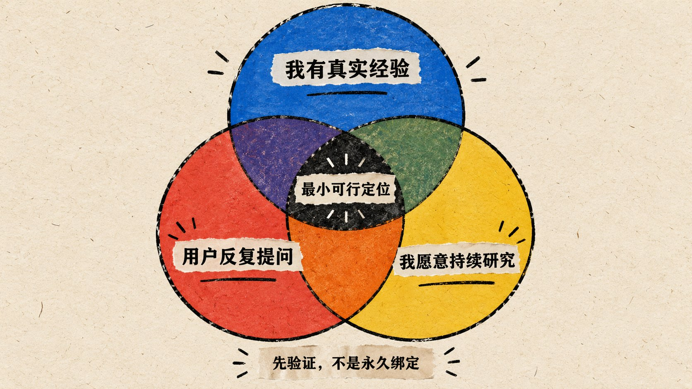
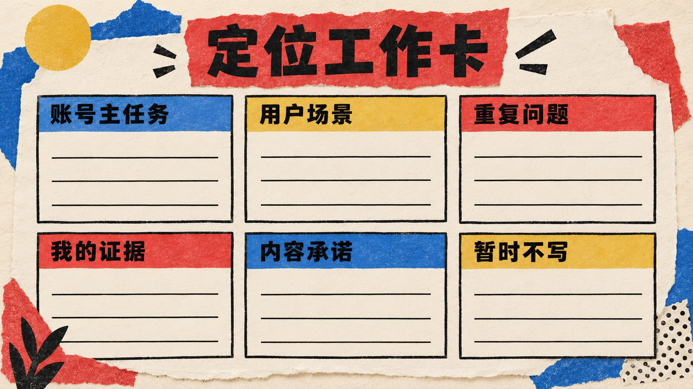
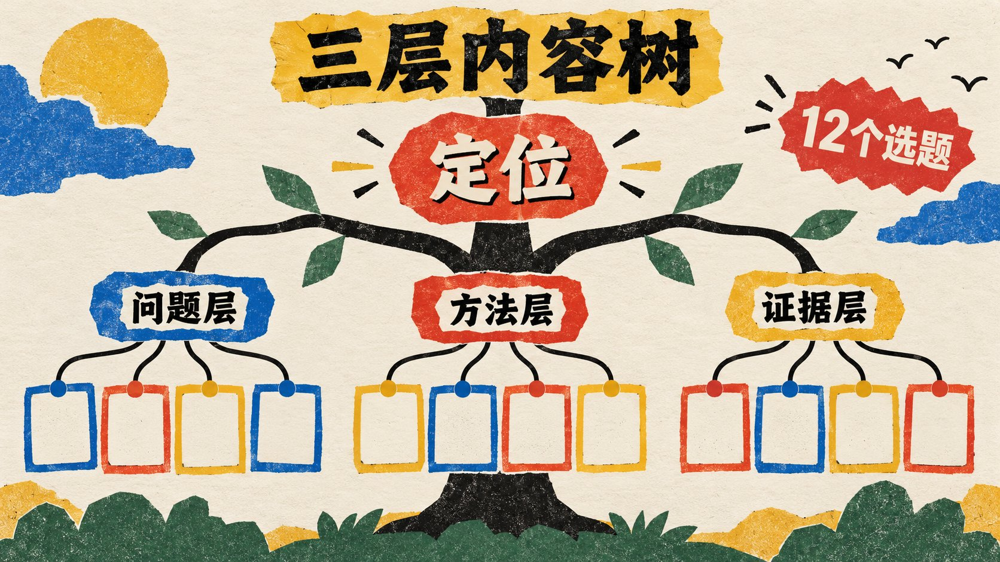
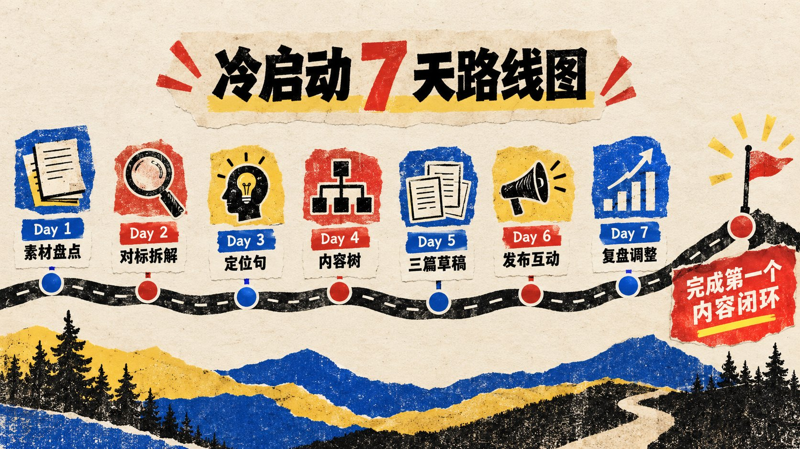

# 小红书起号第一步，直接抄这个SOP

- 作者：Jessi Cao (@JessiCao316191)
- 发布时间：2026-10-07T03:30:17.000Z
- 原文：https://x.com/JessiCao316191/status/2107674848457843182
- 数据：浏览 21424 · 点赞 130 · 转帖 10 · 引用 9 · 回复 9 · 收藏 216

推文导语：

> 很多人做小红书，第一步就开始日更
> 
> 发了几篇没数据，又去研究养号、设备和发布时间
> 真正的问题可能更早：陌生人看完主页，还是不知道你是谁、能帮他解决什么。
> 
> 我把小红书冷启动这 7 天 SOP，开始发内容之前，先把这一步做完👇

小红书冷启动第一步：先别急着发内容，先搭好你的定位系统

很多人准备做小红书，第一反应是先注册账号、研究发布时间、找热门模板，然后逼自己每天发一篇。发了几天以后，数据没有明显变化，就开始怀疑是不是账号有问题、设备有问题，或者自己还没有“养好号”。

把顺序倒过来。小红书冷启动的第一步不是日更，也不是先把主页装修得很精致，而是先做出一个最小可行定位：你准备长期帮哪一类人解决什么问题，为什么这件事由你来说，以及接下来至少能围绕它写出哪些内容。

定位不是一句看起来专业的简介，也不是要求你未来一年只能聊一个话题。它更像一个准备拿去验证的工作假设。一个合格的冷启动定位，至少要让陌生人看到你的标题和主页时，很快判断出“这和我有没有关系”；也要让你坐下来写内容时，不需要每天从空白开始找灵感。

如果这一步没做，后面越勤奋，账号越容易变成一个杂乱的收藏夹。今天写 AI 工具，明天写职场感悟，后天看到别人做副业爆了，又临时换成赚钱教程。每一篇单独看可能都没错，但平台和读者很难形成连续认知，你自己也无法判断究竟哪类内容值得继续。

这篇就把小红书冷启动的第一步拆成一套可以直接执行的流程

做完后，你应该拿到四样东西：**一句定位、一个目标用户场景、三条内容主线，以及首批 12 个可以直接动笔的选题**

## 一、先确定你做的是哪一种账号

开始之前，先把账号任务说清楚。个人 IP、产品品牌号、门店获客号和纯内容号的起点并不一样。个人 IP 需要积累对“这个人”的信任；产品号要让潜在用户理解使用场景；本地门店要解决到店决策；纯内容号更依赖稳定的内容供给和明确的阅读收益。

冷启动时只选一个主任务。你可以同时有很多能力，也可以在未来卖不同产品，但新账号最怕一开始就把所有目标堆在一起。既想记录生活，又想接咨询，还想推产品、招人和做品牌，最后每类读者都只看到一小块与自己有关的内容。

可以先写下这句话：

“接下来的 30 篇内容，我希望这个账号先帮我完成 ______。”

答案可以是积累某个领域的专业认知、找到第一批潜在客户、建立一个清晰的个人标签，或者验证某类选题是否有人需要。这里的 30 篇不是平台规定，只是帮你暂时收住边界。冷启动阶段需要的是连续反馈，不是一次把人生所有主题都讲完。

## 二、不要先选赛道，先盘点你能提供什么

很多定位失败，是因为一上来就选“热门赛道”。母婴、职场、AI、副业、成长，这些都只是大分类，还不是你的内容。真正能支撑长期输出的，是你手里已经有的经验、过程和证据。

给自己 30 分钟，分别列三张清单

第一张是“我做过什么”。写具体项目、工作经历、踩过的坑、实际用过的工具，以及你已经跑通过的微小结果。不要只写“懂运营”，可以写“做过产品从 0 到 1 的内容冷启动”“长期跟海外 creator 合作”“给 AI 产品做过 X、LinkedIn 和小红书内容”。具体经历才会自然长出选题。

第二张是“别人经常问我什么”。翻聊天记录、群聊、评论区和私信，把重复问题原样记下来。别人愿意开口问的问题，通常比你闭门想出来的“用户需求”更接近真实场景。

第三张是“我愿意持续研究什么”。有些内容你能写三篇，但写到第十篇就只剩改标题。冷启动不是押中一条爆款就结束，你需要一个至少愿意继续验证三个月的主题。

以我自己为例，反复出现的不是一个抽象的“增长”标签，而是几个更具体的场景：AI product Growth、产品出海、X 与小红书冷启动、creator 合作，以及小团队如何用 workflow 放大执行效率。它们之间有交集，也有真实项目作为支撑，所以比硬选一个热门赛道更容易持续

## 三、把“目标用户”写成一个具体时刻

“职场女性”“年轻人”“宝妈”“创业者”都太宽。真正影响内容点击的，不只是一个人的身份，而是他正在做什么。

同样是做 AI 产品的人，刚有 idea、已经做出 MVP、准备出海、正在找第一批付费用户，关心的问题完全不同。定位里写清楚场景，你的标题才不会永远停在“新手必看”“建议收藏”这种没有对象的表达上。

可以用下面四个问题把用户收窄：

1. 他现在正准备完成什么任务？
2. 他卡在哪一步？
3. 他已经试过什么，但为什么没解决？
4. 看完你的内容，他下一步能做什么？
例如，“想做小红书的人”可以继续收窄成：“已经有专业经验或产品，但不知道如何把经验变成小红书内容的个人和小团队。”他们的问题通常不是完全没有内容，而是信息很多、主线不清楚，不知道第一批内容该从哪里开始。

用户越具体，内容反而越容易写。因为你不再面对一个模糊的“所有人”，而是在回答一个真实的人此刻会提出的问题。

## 四、写出一句能指导选题的定位

现在把前面的信息压缩成一句话：

“我为【处在什么场景的人】，持续拆解【哪一类问题】，主要用【什么经验或内容形式】，帮助他们【完成什么下一步】。”

例如：

“我为正在从 0 开始做小红书的个人和小团队，持续拆解定位、选题与内容生产流程，用真实运营记录和可复制模板，帮助他们完成第一批能被验证的内容。”

这句话不用原样放进简介。它首先是给你自己用的过滤器。以后遇到一个选题，先问它是否服务同一类人，是否解决同一组问题，是否能体现你的经验。如果三个答案都是否，这条内容就算很热门，也不一定适合在冷启动阶段发布。

一个好定位还要经得起“12 个选题测试”。如果写完定位以后，你仍然列不出 12 个彼此相关、但不重复的选题，通常有两种原因：定位太空，只有“分享成长”这类大词；或者定位太窄，只够写一篇教程。先调整范围，再去做主页包装。

## 五、做对标时，拆结构，不要复制表面

定位有了以后，再去找对标账号。顺序不能反，因为没有自己的判断标准时，对标很容易变成抄标题、抄封面，最后连对方为什么这样写都不知道。

建议先找 12 个样本：4 个和你主题接近的账号，4 个服务相似人群但主题不同的账号，再找 4 个你喜欢其表达方式的账号。让样本既有相关性，也不至于把自己训练成某一个人的复制品。

每个账号只记录六项：

- 它在帮助哪类人完成什么任务；
- 哪些选题反复出现；
- 标题怎样描述具体问题；
- 正文靠什么建立可信度；
- 评论区继续追问什么；
- 它如何把读者引向下一篇内容、主页或产品。
重点看重复出现的结构，不要只截几篇高赞内容。单篇数据可能受发布时间、热点和已有粉丝影响，连续内容更能说明这个账号靠什么建立认知。

对标完成后，把能借鉴的部分翻译成自己的资产。别人用减脂案例解释习惯，你可以用产品冷启动案例解释内容验证；别人靠职业经历建立可信度，你要找到自己能公开的项目过程。结构可以学，经历不能借。

## 六、用三层内容树，生成首批 12 个选题

冷启动的内容不要从“今天发什么”开始想，而要从定位拆出三条内容主线。

第一条是问题层：用户现在最容易误判什么、卡在哪里。这类内容负责让目标读者认出自己，例如“为什么你写了十篇，小红书主页还是看不出你是做什么的”。

第二条是方法层：具体怎么做，用什么模板、步骤和工具。这类内容负责提供收藏价值，例如“一张表完成小红书账号定位”“如何从聊天记录里提取第一批选题”。

第三条是证据层：真实过程、案例、失败记录和复盘。这类内容负责建立信任，例如“我如何把一条群聊问题改成一篇内容”“一次定位调整前后，选题为什么更集中”。没有公开数据时就讲过程，不要为了显得专业编一个漂亮结果。

每条主线先写 4 个选题，正好得到首批 12 个。写标题时尽量包含对象、场景和动作，让人一眼知道这篇解决什么。比如“新手如何做定位”很泛，“已经有专业经验，但不会做小红书：先填完这张定位卡”就清楚得多。

## 七、最后再装修主页，让承诺前后一致

完成定位和内容树后，再处理昵称、简介、头像与置顶内容。主页的任务不是展示你会多少，而是降低理解成本。

昵称可以保留个人识别，同时补充一个明确身份或领域词；简介说明你在做什么、内容对谁有用，以及读者可以期待什么；置顶内容优先选择自我介绍、代表性方法或新读者入口。头像清楚、稳定即可，不需要在冷启动前花几天反复换视觉方案。

主页、标题和正文要说同一件事。如果简介写“AI 产品出海增长”，内容却长期只有泛职场感悟，即使偶尔获得流量，也很难转化成稳定关注。定位的作用就是让这些触点彼此对齐。

账号、设备和网络环境只需要遵守正常使用与平台规则，保持资料真实、操作自然和账号安全。不要把所谓“防关联”“特殊养号”当成内容冷启动的核心，更不要用它替代定位和内容。基础设置有问题当然要处理，但它不会自动帮你建立读者认知。

## 八、用 7 天跑完第一个内容闭环

定位不需要在文档里打磨一个月。它必须进入真实发布，才能获得反馈。你可以用下面这套 7 天节奏完成第一次验证：

第 1 天，完成三张个人素材清单，确定账号的单一主任务。

第 2 天，拆解 12 个对标样本，记录用户、选题、证据和评论区问题。

第 3 天，写出定位句，完成“12 个选题测试”，删掉明显跑偏的方向。

第 4 天，建立问题层、方法层和证据层内容树，写出首批 12 个题目。

第 5 天，完成前三篇内容草稿，分别覆盖一个问题、一个方法和一个真实过程。

第 6 天，发布第一篇，同时正常阅读和回复同领域内容，观察读者使用的真实词汇。

第 7 天，复盘首篇内容带来的信号，并修改后两篇。不要只看点赞，也要看收藏、评论里的追问、主页访问，以及有没有人准确复述你的主题。数据量很小时不要急着下大结论，先记录哪些表达让目标用户愿意停下来。

## 九、冷启动阶段，先验证认知，不要急着证明成功

新号最容易被粉丝数牵着走。但粉丝是结果，不是你第一天能直接控制的动作。你能控制的是：有没有持续回答同一类人的问题，内容是否给出具体下一步，读者点进主页后能不能理解你是谁。

第一轮复盘只回答三个问题：

1. 哪类问题最容易让目标用户停下来？
2. 哪种内容最能体现你的真实经验，而不是通用知识？
3. 评论和私信出现了哪些新问题，可以进入下一轮选题？
如果问题层内容有人看，方法层没人收藏，可能是步骤还不够具体；如果单篇有流量但主页没有连续感，可能是内容树太散；如果你每次写都很痛苦，可能定位建立在热门话题上，却没有足够个人素材支撑。按症状改一项，不要发两篇就整体换赛道。

## 十、发布前，用这张清单检查

- 我能否用一句话说清这个账号先服务谁？
- 我写的是一个具体场景，而不是宽泛人群吗？
- 我的定位里有真实经历或证据支撑吗？
- 我能围绕它列出至少 12 个不重复的选题吗？
- 问题层、方法层、证据层是否都已经有内容？
- 昵称、简介、置顶和正文是否在传递同一个认知？
- 我是否已经安排好发布后的记录与复盘，而不是只等涨粉？
这七项大部分能回答，小红书冷启动才算真正开始。

我以前也容易直接跳到“怎么发”“一天发几篇”“什么标题更容易爆”这些问题。后来做不同平台的内容和产品增长，我越来越在意前面的那一步：先找到潜在用户，再决定用什么内容接住他们。平台可以换，表达形式可以换，这个顺序不会轻易变。

先把定位当作一个可以验证的假设，跑完第一轮内容闭环。你不需要第一天就找到完美答案，但至少要知道自己正在验证什么。
